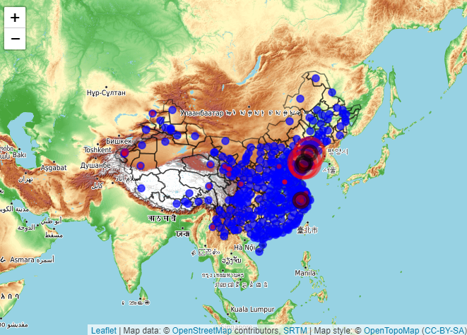

```{r setup, include=FALSE}
knitr::opts_chunk$set(echo = TRUE)
```

# Data download

Download the air quality data for each city in China from 01-01-2020 to 31-12-2020 according to the file city.csv. The downloaded data is saved in the data folder in this directory, each city is a folder, each folder contains 12 files, and a csv file is stored every month. The code for scraping data is [01_downloading.R](#)

# Data preprocessing

## Files merging

Combine all the CSV files in all the folders downloaded above into one CSV file. At the same time (1) translate Chinese city names into English; (2) generate the season column according to the date; (3) generate the current date, the day of the week according to the date. The result of the combination is [AQI_2020.csv](#). The code for merging data is [02_preprocessing.R](#)

## Check if the merged result is correct

Use the code setdiff(cityname,unique(df$cn_zh)) to check. Where cityname represents the list of all downloaded cities. unique(df$cn_zh) reprensebts the list of merged cities. The reults show that there are 5 cities that have not been merged, namely "Qamdo area", "Laiwu", "Nyingchi area", "Rigaze area" and "Shannan ares". Furthur study finds that the data of 5 cities were empty, so they were deleted. In addition, when the names of Chinese cities are translated into English, numbers are added after the city names to distinguish cities with the same pronunciation. For example, Yulin4 and Yulin2; Fuyang1 and Fuyang2.

## Check the integrity of the merged data

```{r echo=TRUE, message=FALSE, warning=FALSE}
library(pacman)
p_load(tidyverse,VIM,here,leaflet,sf,openair,lubridate,magrittr,cluster,gridExtra)
AQI<-read_csv(here("data","AQI_2020.csv"),
              col_types=cols(time=col_date(format = "%Y/%m/%d")))
nrow(AQI)
aggr(AQI,prop=FALSE, numbers=TRUE)
```

As can be seen from the figure above, the combined data has no missing values. A total of 132113 lines. In this data, if AQI is missing during the actual recording process, it will be recorded as 0, so the number of each index 0 is further counted.

```{r echo=TRUE, message=FALSE, warning=FALSE}
MissingAQI<-AQI%>%filter(AQI==0)%>%select(cn_en)%>%add_count(cn_en,sort=TRUE)%>%unique()
MissingAQI
```

## Show the specific location of each city

The figure below shows the location of all cities and the city with missing values (red). The size of the circle indicates how much the missing value is. It can be seen from the figure that the density of urban distribution is large in the east and small in the west. In order not to reduce the density of western cities as much as possible, we deleted 4 of them (black). Currently, the city with the most missing values is "KeZiLeSuZhou", with a missing value of 33/367=9%.

```{r echo=TRUE, message=FALSE, warning=FALSE}
city<-read.csv(here("city.csv"))
Missingcity<-left_join(MissingAQI,city,by=c("cn_en"="cn_en"))
deletedcity<-filter(Missingcity,
                    cn_en %in% c("PengLai",
                                 "WaFangDian",
                                 "ZhaoYuan",
                                 "FuYang2"))
border<-st_read(here("shp/CHN_adm2.shp"))
p<-city%>%
  leaflet()%>%
  addProviderTiles("OpenTopoMap")%>%
  addPolygons(data=border,
              fill = FALSE,
              weight =1.5,
              color="black")%>%
  addCircleMarkers(lng=~lon,
                   lat=~lat,
                   radius=5,
                   weight=2,
                   color="blue",
                   fillOpacity=0.7,
                   label = ~cn_en)%>%
  addCircleMarkers(lng=Missingcity$lon,
                   lat=Missingcity$lat,
                   color="red",
                   fillColor = "red",
                   radius=Missingcity$n/10,
                   label = Missingcity$cn_en)%>%
  addCircleMarkers(lng=deletedcity$lon,
                   lat=deletedcity$lat,
                   color="black",
                   fillColor = "black",
                   label = deletedcity$cn_en)

#p
```



```{r echo=TRUE, message=FALSE, warning=FALSE}
data<-filter(AQI, !(cn_en %in% c("PengLai",
                         "WaFangDian",
                         "ZhaoYuan",
                         "FuYang2")))%>%
  mutate(ID=seq(1,length(.$cn_en)))%>%
  select(ID,cn_en,date=time,5:last_col())


length(unique(data$cn_en))
```

Finally, data of AQI, PM2.5, PM10, SO2, NO2, CO, O3 from 353 cities from 1-1-2020 to 31-12-2020 is used to analyze the time and spatial characteristics of air quality in major cities in China.
