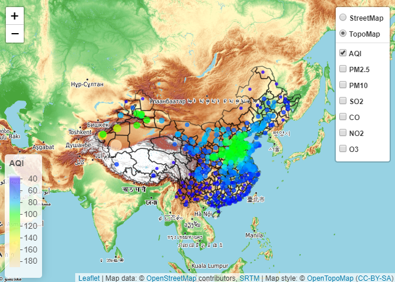

```{r setup, include=FALSE}
knitr::opts_chunk$set(echo = TRUE)
library(openair)
```

## Spatial distribution characteristics

```{r echo=TRUE, message=FALSE, warning=FALSE}
year_data<-data%>%group_by(cn_en=.$cn_en)%>%summarise(mAQI=mean(AQI),
                                mPM25=mean(PM25),
                                mPM10=mean(PM10),
                                mSO2=mean(SO2),
                                mCO=mean(CO),
                                mNO2=mean(NO2),
                                mO3=mean(O3))
year_data<-left_join(year_data,city,by=c("cn_en"="cn_en"))%>%
  select(cn_en,lon,lat,2:8)

pal_mAQI<-colorNumeric(c("transparent",topo.colors(100,alpha = NULL)), year_data$mAQI)
pal_mPM25<-colorNumeric(c("transparent",topo.colors(100,alpha = NULL)), year_data$mPM25)
pal_mPM10<-colorNumeric(c("transparent",topo.colors(100,alpha = NULL)), year_data$mPM10)
pal_mSO2<-colorNumeric(c("transparent",topo.colors(100,alpha = NULL)), year_data$mSO2)
pal_mCO<-colorNumeric(c("transparent",topo.colors(100,alpha = NULL)), year_data$mCO)
pal_mNO2<-colorNumeric(c("transparent",topo.colors(100,alpha = NULL)), year_data$mNO2)
pal_mO3<-colorNumeric(c("transparent",topo.colors(100,alpha = NULL)), year_data$mO3)
p<-year_data%>%
  leaflet()%>%
  addProviderTiles("OpenTopoMap",group="TopoMap")%>%
  addProviderTiles("OpenStreetMap",group="StreetMap")%>%
  addPolygons(data=border,fill = FALSE, weight =1.5,color="black")%>%
  addCircleMarkers(lng=~lon,lat=~lat,radius=~mAQI/20,weight=2, color=~pal_mAQI(year_data$mAQI),
                   fillOpacity=0.7,label = ~mAQI, group="AQI")%>%
  addCircleMarkers(lng=~lon,lat=~lat,radius=~mPM25/20,weight=2, color=~pal_mPM25(year_data$mPM25),
                 fillOpacity=0.7,label = ~mPM25, group="PM2.5")%>%
  addCircleMarkers(lng=~lon,lat=~lat,radius=~mPM10/20,weight=2, color=~pal_mPM10(year_data$mPM10),
                 fillOpacity=0.7,label = ~mPM10, group="PM10")%>%
  addCircleMarkers(lng=~lon,lat=~lat,radius=~mSO2/10,weight=2, color=~pal_mSO2(year_data$mSO2),
                 fillOpacity=0.7,label = ~mSO2, group="SO2")%>%
  addCircleMarkers(lng=~lon,lat=~lat,radius=~mCO/10,weight=2, color=~pal_mCO(year_data$mCO),
                 fillOpacity=0.7,label = ~mCO, group="CO")%>%
  addCircleMarkers(lng=~lon,lat=~lat,radius=~mNO2/10,weight=2, color=~pal_mNO2(year_data$mNO2),
                 fillOpacity=0.7,label = ~mNO2, group="NO2")%>%
  addCircleMarkers(lng=~lon,lat=~lat,radius=~mO3/20,weight=2, color=~pal_mO3(year_data$mO3),
                 fillOpacity=0.7,label = ~mO3, group="O3")%>%
  addLayersControl(baseGroups=c("StreetMap","TopoMap"),
                   overlayGroups = c("AQI","PM2.5","PM10","SO2","CO","NO2","O3"),
                   options=layersControlOptions(collapsed = FALSE))%>%
  addLegend("bottomleft",pal=pal_mAQI,values=year_data$mAQI,title="AQI",group="AQI")%>%
  addLegend("bottomleft",pal=pal_mAQI,values=year_data$mAQI,title="PM2.5",group="PM2.5")%>%
  addLegend("bottomleft",pal=pal_mAQI,values=year_data$mAQI,title="PM10",group="PM10")%>%
  addLegend("bottomleft",pal=pal_mAQI,values=year_data$mAQI,title="CO",group="CO")%>%
  addLegend("bottomleft",pal=pal_mAQI,values=year_data$mAQI,title="NO2",group="NO2")%>%
  addLegend("bottomleft",pal=pal_mAQI,values=year_data$mAQI,title="O3",group="O3")

#p
```


