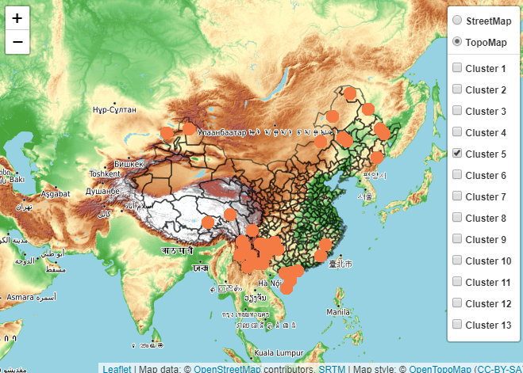

```{r setup, include=FALSE}
knitr::opts_chunk$set(echo = TRUE)
library(openair)
```

## Clustering characteristics of air quality in all cities in China analyzed by Kmeans

```{r echo=TRUE, message=FALSE, warning=FALSE}
library(gridExtra)
# standarized

city_cluster<-apply(year_data[,4:10],2,scale)
set.seed(1234)

tot_withinss<-vector()
betweenss<-vector()
kk<-30
for(ii in 1:kk){
  k1 <- kmeans(city_cluster,ii,iter.max = 100,algorithm = "MacQueen")
  tot_withinss[ii] <- k1$tot.withinss
  betweenss[ii] <- k1$betweenss
}
kmeanvalue <- data.frame(kk = 1:kk,
                         tot_withinss = tot_withinss,
                         betweenss = betweenss)

p1 <- ggplot(kmeanvalue,aes(x = kk,y = tot_withinss))+
  theme_bw(base_family = "STKaiti") +
  geom_point(colour = "red") +
  geom_line() +
  labs(x = "the number of clusters for kmean",y = "value") +
  ggtitle("squared sum within groups")+
  theme(plot.title = element_text(hjust = 0.5))


p2 <- ggplot(kmeanvalue,aes(x = kk,y = betweenss))+
  theme_bw(base_family = "STKaiti") +
  geom_point(colour = "red") +
  geom_line() +
  labs(x = "the number of clusters for kmean",y = "value") +
  ggtitle("squared sum between groups")+
  theme(plot.title = element_text(hjust = 0.5))


grid.arrange(p1,p2,nrow = 2)

```

As can be seen from the above figure, by trying a series of Kmeans cluster, the cluster data is defined as 13 categories (in fact, more than 13 categories are acceptable). Because the changes in these two indicators are quite drastic before 13, it is classified as 13 categories.

```{r echo=TRUE, message=FALSE, warning=FALSE}
k<-13
kcluster<-kmeans(city_cluster,k,iter.max = 100,algorithm = "MacQueen")
kcluster
```

Check the number of each category

```{r echo=TRUE, message=FALSE, warning=FALSE}
table(kcluster$cluster)
```

Visualization of clustering results

```{r echo=TRUE, message=FALSE, warning=FALSE}
clusplot(city_cluster,kcluster$cluster,main = paste("kmean cluster number=",k,sep = ""))
```

Clustering effect (contour coefficient)
>The contour coefficient is the evaluation index of the most commonly used clustering algorithm. It is defined for each sample, and it can simultaneously measure the similarity between the sample and other samples in its own cluster, as well as between the sample and samples in the other clusters. The value range of contour coefficient is (-1,1). The closer to 1 means the better the cluster effect is, and the negative number means the cluster effect is very poor.

```{r echo=TRUE, message=FALSE, warning=FALSE}
si1 <- silhouette(kcluster$cluster,dist(city_cluster,method = "euclidean"))
par(cex = 0.9)
plot(si1,main = "kmean silhouette",col = "red")
```

From the contour information diagram of the above cluster, we can find that the cluster effect is good.

```{r echo=TRUE, message=FALSE, warning=FALSE}
city_clu<-data.frame(city=year_data$cn_en,
                     lon=year_data$lon,
                     lat=year_data$lat,
                     cluster=kcluster$cluster)

clucolor<-colorFactor("Paired",city_clu$cluster)
cl<-list()

for (i in 1:13){
  cl[[i]]<-filter(city_clu,cluster==i)
}

p<-city_clu%>%leaflet() %>%
  addProviderTiles("OpenTopoMap",group="TopoMap")%>%
  addProviderTiles("OpenStreetMap",group="StreetMap")%>%
  addPolygons(data=border,fill = FALSE, weight =1.5,color="black")%>%
  addCircleMarkers(data=cl[[1]],
                   lng=~lon,
                   lat=~lat,
                   stroke = FALSE,
                   radius=8,
                   color=~clucolor(city_clu$cluster)[1],
                   fillOpacity=1,
                   popup = ~paste(city_clu$city,city_clu$cluster,sep = ":Cluster "),
                   group="Cluster 1")%>%
  addCircleMarkers(data=cl[[2]],
                   lng=~lon,
                   lat=~lat,
                   stroke = FALSE,
                   radius=8,
                   color=~clucolor(city_clu$cluster)[2],
                   fillOpacity=1,
                   popup = ~paste(city_clu$city,city_clu$cluster,sep = ":Cluster "),
                   group="Cluster 2")%>%
  addCircleMarkers(data=cl[[3]],
                   lng=~lon,
                   lat=~lat,
                   stroke = FALSE,
                   radius=8,
                   color=~clucolor(city_clu$cluster)[3],
                   fillOpacity=1,
                   popup = ~paste(city_clu$city,city_clu$cluster,sep = ":Cluster "),
                   group="Cluster 3")%>%
  addCircleMarkers(data=cl[[4]],
                   lng=~lon,
                   lat=~lat,
                   stroke = FALSE,
                   radius=8,
                   color=~clucolor(city_clu$cluster)[4],
                   fillOpacity=1,
                   popup = ~paste(city_clu$city,city_clu$cluster,sep = ":Cluster "),
                   group="Cluster 4")%>%
  addCircleMarkers(data=cl[[5]],
                   lng=~lon,
                   lat=~lat,
                   stroke = FALSE,
                   radius=8,
                   color=~clucolor(city_clu$cluster)[5],
                   fillOpacity=1,
                   popup = ~paste(city_clu$city,city_clu$cluster,sep = ":Cluster "),
                   group="Cluster 5")%>%
  addCircleMarkers(data=cl[[6]],
                   lng=~lon,
                   lat=~lat,
                   stroke = FALSE,
                   radius=8,
                   color=~clucolor(city_clu$cluster)[6],
                   fillOpacity=1,
                   popup = ~paste(city_clu$city,city_clu$cluster,sep = ":Cluster "),
                   group="Cluster 6")%>%
  addCircleMarkers(data=cl[[7]],
                   lng=~lon,
                   lat=~lat,
                   stroke = FALSE,
                   radius=8,
                   color=~clucolor(city_clu$cluster)[7],
                   fillOpacity=1,
                   popup = ~paste(city_clu$city,city_clu$cluster,sep = ":Cluster "),
                   group="Cluster 7")%>%
  addCircleMarkers(data=cl[[8]],
                   lng=~lon,
                   lat=~lat,
                   stroke = FALSE,
                   radius=8,
                   color=~clucolor(city_clu$cluster)[8],
                   fillOpacity=1,
                   popup = ~paste(city_clu$city,city_clu$cluster,sep = ":Cluster "),
                   group="Cluster 8")%>%
  addCircleMarkers(data=cl[[9]],
                   lng=~lon,
                   lat=~lat,
                   stroke = FALSE,
                   radius=8,
                   color=~clucolor(city_clu$cluster)[9],
                   fillOpacity=1,
                   popup = ~paste(city_clu$city,city_clu$cluster,sep = ":Cluster "),
                   group="Cluster 9")%>%
  addCircleMarkers(data=cl[[10]],
                   lng=~lon,
                   lat=~lat,
                   stroke = FALSE,
                   radius=8,
                   color=~clucolor(city_clu$cluster)[10],
                   fillOpacity=1,
                   popup = ~paste(city_clu$city,city_clu$cluster,sep = ":Cluster "),
                   group="Cluster 10")%>%
  addCircleMarkers(data=cl[[11]],
                   lng=~lon,
                   lat=~lat,
                   stroke = FALSE,
                   radius=8,
                   color=~clucolor(city_clu$cluster)[11],
                   fillOpacity=1,
                   popup = ~paste(city_clu$city,city_clu$cluster,sep = ":Cluster "),
                   group="Cluster 11")%>%
  addCircleMarkers(data=cl[[12]],
                   lng=~lon,
                   lat=~lat,
                   stroke = FALSE,
                   radius=8,
                   color=~clucolor(city_clu$cluster)[12],
                   fillOpacity=1,
                   popup = ~paste(city_clu$city,city_clu$cluster,sep = ":Cluster "),
                   group="Cluster 12")%>%
  addCircleMarkers(data=cl[[13]],
                   lng=~lon,
                   lat=~lat,
                   stroke = FALSE,
                   radius=8,
                   color=~clucolor(city_clu$cluster)[13],
                   fillOpacity=1,
                   popup = ~paste(city_clu$city,city_clu$cluster,sep = ":Cluster "),
                   group="Cluster 13")%>%
addLayersControl(baseGroups=c("StreetMap","TopoMap"),
                 overlayGroups = c("Cluster 1","Cluster 2","Cluster 3","Cluster 4","Cluster 5",
                                   "Cluster 6","Cluster 7","Cluster 8","Cluster 9","Cluster 10",
                                   "Cluster 11","Cluster 12","Cluster 13"),
                 options=layersControlOptions(collapsed = FALSE))    

#p
```

